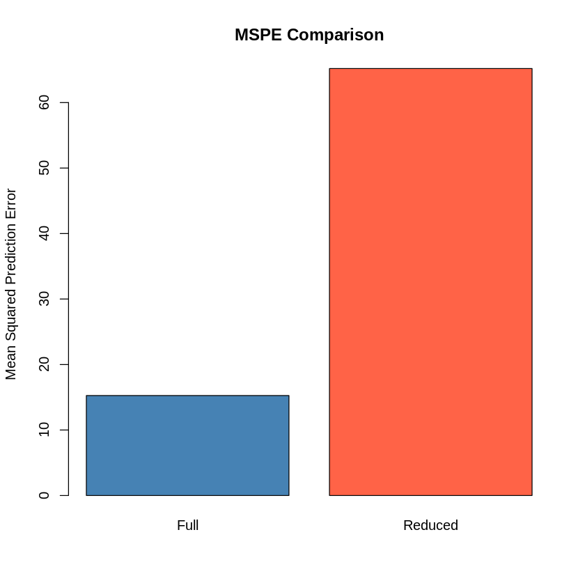
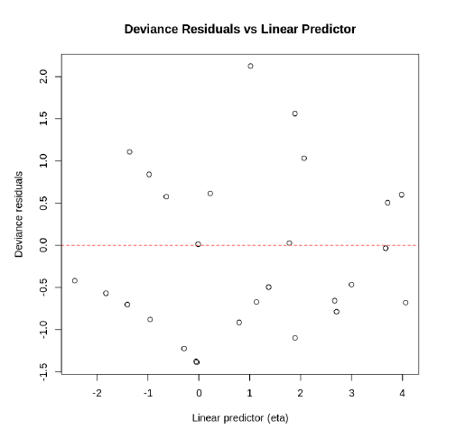
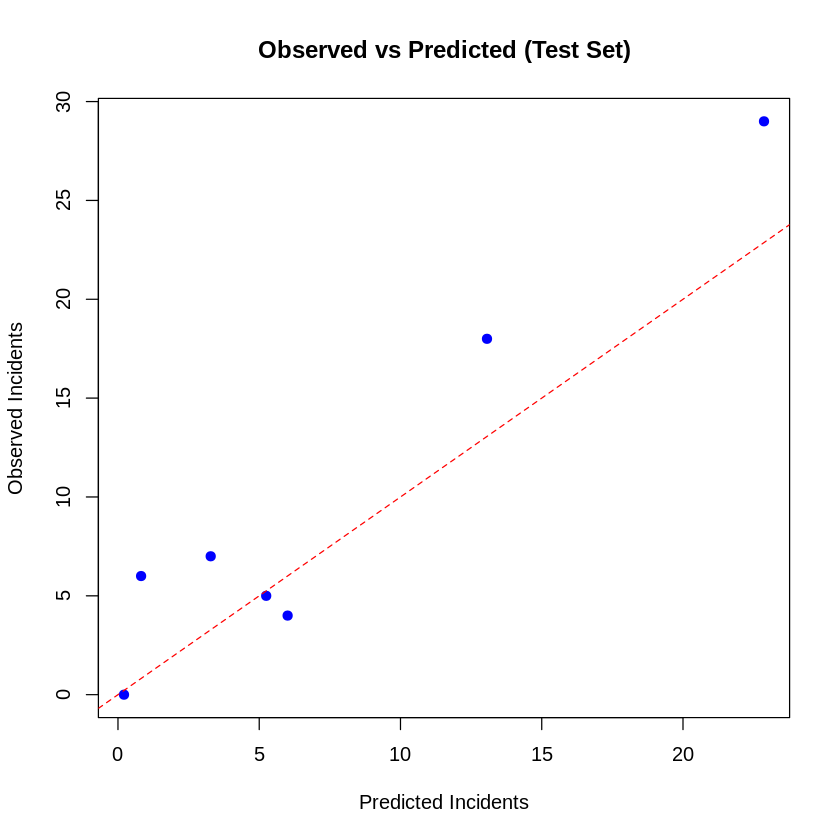
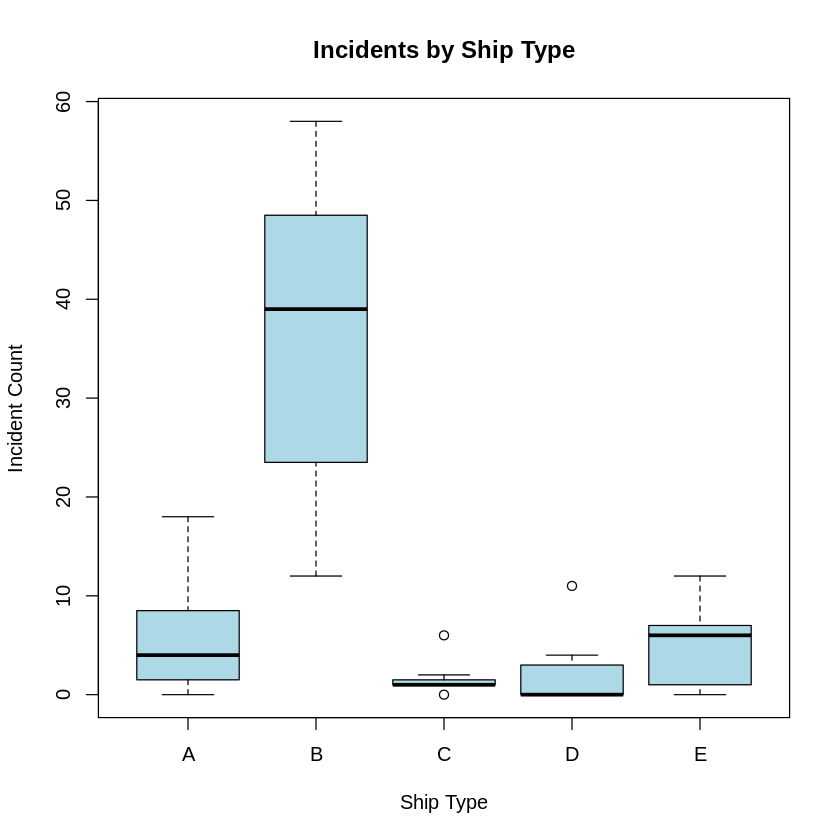

# Poisson Regression: Ship Incident Modeling (Statistical Modeling for Data Science Applications - Peer Reviewed Assignment)

## Overview

This project models ship damage incidents using **Poisson regression**.  
I compare **full and reduced models**, evaluate predictive accuracy using **MSPE**, check for **overdispersion**, and visualize key **diagnostics** to assess model fit.

---

## Problem

I'm analyzing a dataset of ship damage incidents. Each ship type was observed over a number of months, and I want to understand what factors contribute to more (or fewer) incidents. Since the outcome is **count data** relative to time (service months), **Poisson regression** is appropriate.

---

## Data Summary

Variables include:

- `incidents`: Number of damage incidents (count)
- `service`: Total months of service (exposure)
- `type`: Ship type (categorical)
- `year`: Year built (categorical)
- `period`: Operation period (categorical)

---

## Model 1: Full Poisson Model

I fit a Poisson model using all predictors:

```r
model <- glm(incidents ~ type + period + year,
             family = poisson,
             data = train,
             offset = log(service))
```

### Why offset `log(service)`?

To convert the model from a *count* to a *rate* model (incidents per month).

### MSPE: Full vs Reduced Model



```r
mspe_full <- mean((test$incidents - predict(model, newdata = test, type = "response"))^2)
# MSPE = 15.26
```

*The mean squared prediction error (MSPE) for the full model is 15.26.*

---

## Model 2: Reduced Poisson Model

I tried dropping `year` to test if it improves generalization:

```r
model_reduced <- glm(incidents ~ type + period,
                     family = poisson,
                     data = train,
                     offset = log(service))
```

### MSPE:

```r
# MSPE = 65.20 (worse!)
```

*The MSPE increased significantly to 65.20, indicating that dropping `year` reduced predictive performance.*

✅ The full model is better — including `year` improves prediction accuracy.

---

## Deviance Testing

I compared models using deviance to assess model fit:

### Null vs Full:

```r
anova(null_model, full_model, test = "Chisq")
# p < 0.001 → Full model is a huge improvement
```

### Full vs Reduced:

```r
anova(full_model, reduced_model, test = "Chisq")
# p < 0.001 → Removing `year` significantly worsens fit
```

✅ I chose to stick with the full model.

---

## Residuals vs Linear Predictor



**Residuals vs. Linear Predictor Plot**  
*Residuals are roughly symmetric and centered around 0 — no strong violations. This supports a good model fit.*

```r
plot(model$linear.predictors, residuals(model, type = "deviance"),
     xlab = "Linear Predictor", ylab = "Deviance Residuals",
     main = "Residuals vs Linear Predictor")
abline(h = 0, col = "red", lty = 2)
```

---

## Overdispersion Check

**Overdispersion Check**  
*A deviance/df ratio of 1.27 suggests mild overdispersion. May warrant quasi-Poisson if model complexity increases.*

```r
summary(model)$deviance / summary(model)$df.residual
# ≈ 1.27 → Slight overdispersion, but not severe
```

---

## Optional Visuals

### Predicted vs Actual (Test Set)



```r
pred <- predict(full_model, newdata = test, type = "response")

plot(pred, test$incidents,
     xlab = "Predicted Incidents",
     ylab = "Observed Incidents",
     main = "Observed vs Predicted (Test Set)",
     pch = 19, col = "blue")
abline(0, 1, col = "red", lty = 2)
```

### Distribution of Incidents by Ship Type



```r
boxplot(incidents ~ type, data = ships,
        main = "Incidents by Ship Type",
        xlab = "Ship Type", ylab = "Incident Count",
        col = "lightblue")
```

---

## Conclusions

- Poisson regression is a solid choice for modeling ship incident *rates*
- Including `year` improves predictive power
- The model fit is adequate (residual checks + deviance tests)
- Slight overdispersion is present but manageable

---

## Possible Next Steps

- Try **quasi-Poisson** or **Negative Binomial** if overdispersion worsens
- Consider interaction terms (e.g., `type × period`)
- Include temporal trends if more detailed date info is available

---
